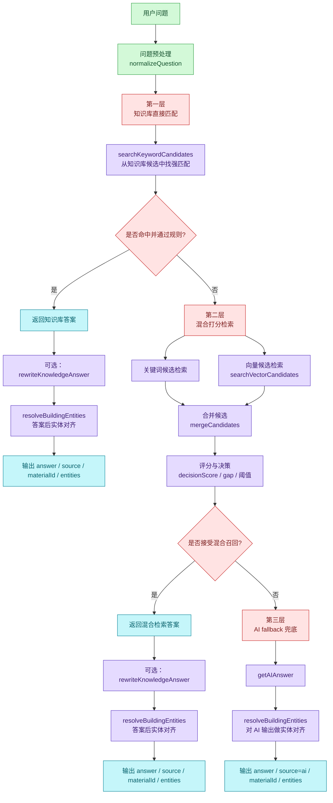

# 核心技术架构与AI三层检索流程图

下面两张图分别对应：

1. 前端到后端的核心技术架构流程
2. AI 问答的三层检索与兜底流程

## 1. 核心技术架构流程图

```mermaid
graph TB
    FE[前端页面\npages/index/index.vue\npages/map/map.vue\npages/detail/detail.vue] -->|发起 API 请求| APP[Express 应用层\nbackend/src/app.js]

    APP -->|CORS / JSON 解析 / 静态资源| ROUTER[路由层\nbackend/src/routes/index.js]

    ROUTER -->|/api/chat| CHAT_CTRL[chatController]
    ROUTER -->|/api/buildings\n/api/material\n/api/knowledge| COMMON_CTRL[业务控制器]
    ROUTER -->|/api/assets / /api/qiniu| ASSET_CTRL[资源控制器]

    CHAT_CTRL --> CHAT_SVC[chatService]
    COMMON_CTRL --> BIZ_SVC[业务 Service]
    ASSET_CTRL --> ASSET_SVC[asset / qiniu Service]

    CHAT_SVC --> HYBRID[hybridRetriever\n混合检索与决策]
    CHAT_SVC --> ENTITY[entityMatcher\n实体对齐]
    BIZ_SVC --> REPO[dataRepository / 各类领域 Service]
    ASSET_SVC --> STORAGE[签名 URL / 对象存储 / 本地静态资源]

    HYBRID --> KB[(知识库 JSON / PostgreSQL\nknowledge_base)]
    HYBRID --> VDB[(向量表 PostgreSQL\nknowledge_embeddings)]
    REPO --> JSONDB[(data-jsondb / backend/data)]
    REPO --> PG[(PostgreSQL 业务表)]
    STORAGE --> LOCAL[(backend/assets / backend/models)]
    STORAGE --> QINIU[(七牛对象存储)]

    CHAT_SVC --> RESP[统一响应封装\n{ code, msg, data }]
    BIZ_SVC --> RESP
    ASSET_SVC --> RESP

    RESP --> FE

    classDef front fill:#e7f5ff,stroke:#1971c2,color:#0b3d91;
    classDef app fill:#f3d9fa,stroke:#862e9e,color:#5a2480;
    classDef control fill:#ffe8cc,stroke:#d9480f,color:#8a3c00;
    classDef service fill:#e5dbff,stroke:#5f3dc4,color:#39207a;
    classDef data fill:#fff4e6,stroke:#e67700,color:#8a4f00;
    classDef output fill:#c5f6fa,stroke:#0c8599,color:#005f6b;

    class FE front;
    class APP app;
    class ROUTER,CHAT_CTRL,COMMON_CTRL,ASSET_CTRL control;
    class CHAT_SVC,BIZ_SVC,ASSET_SVC,HYBRID,ENTITY service;
    class KB,VDB,JSONDB,PG,LOCAL,QINIU data;
    class RESP output;
```

## 2. AI 问答三层检索流程图



## 说明

这两张图按当前后端实现整理：入口是 Express，路由进入 controller，再下沉到 service，数据访问落到 repository 或向量检索；AI 问答则按“知识库优先、混合检索、AI 兜底”三层展开。
