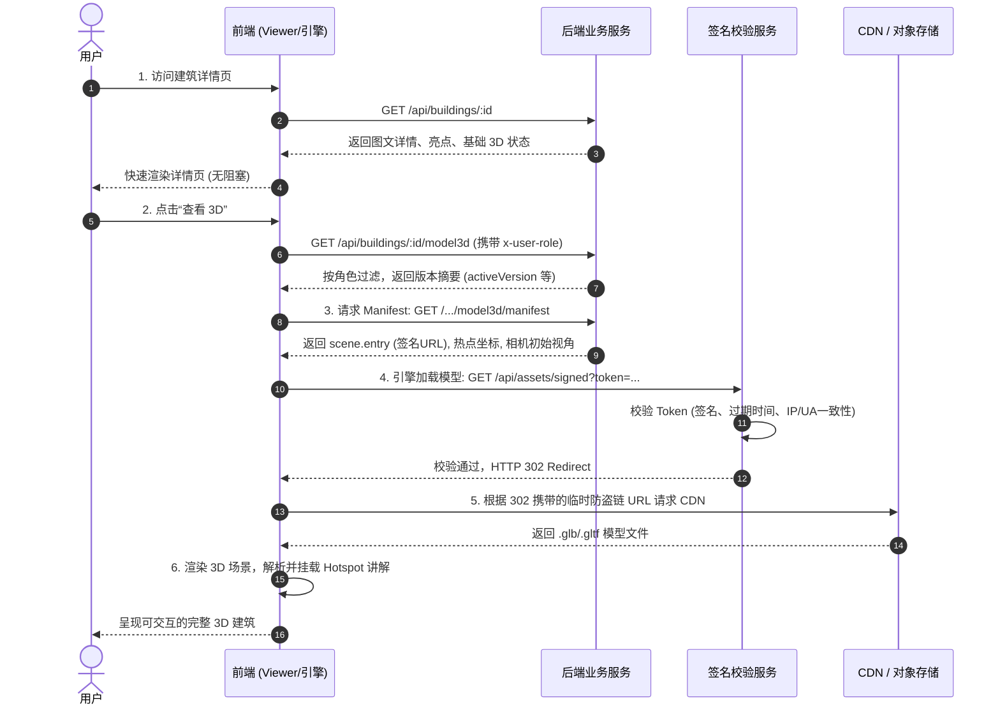

```mermaid
sequenceDiagram
    autonumber
    actor User as 用户
    participant FE as 前端 (Viewer/引擎)
    participant API as 后端业务服务
    participant Auth as 签名校验服务
    participant CDN as CDN / 对象存储

    %% 阶段一：轻量级初始化
    User->>FE: 1. 访问建筑详情页
    FE->>API: GET /api/buildings/:id
    API-->>FE: 返回图文详情、亮点、基础 3D 状态
    FE-->>User: 快速渲染详情页 (无阻塞)

    %% 阶段二：意图驱动与鉴权
    User->>FE: 2. 点击“查看 3D”
    FE->>API: GET /api/buildings/:id/model3d (携带 x-user-role)
    API-->>FE: 按角色过滤，返回版本摘要 (activeVersion 等)
    
    FE->>API: 3. 请求 Manifest: GET /.../model3d/manifest
    API-->>FE: 返回 scene.entry (签名URL), 热点坐标, 相机初始视角

    %% 阶段三：安全加载与渲染
    FE->>Auth: 4. 引擎加载模型: GET /api/assets/signed?token=...
    Auth->>Auth: 校验 Token (签名、过期时间、IP/UA一致性)
    Auth-->>FE: 校验通过，HTTP 302 Redirect
    
    FE->>CDN: 5. 根据 302 携带的临时防盗链 URL 请求 CDN
    CDN-->>FE: 返回 .glb/.gltf 模型文件
    
    FE->>FE: 6. 渲染 3D 场景，解析并挂载 Hotspot 讲解
    FE-->>User: 呈现可交互的完整 3D 建筑
```